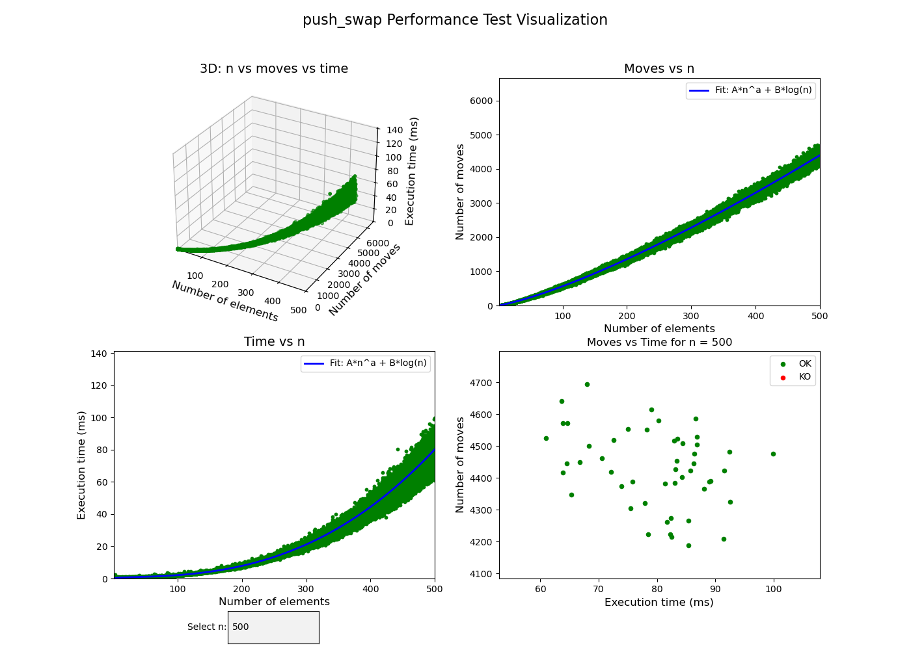
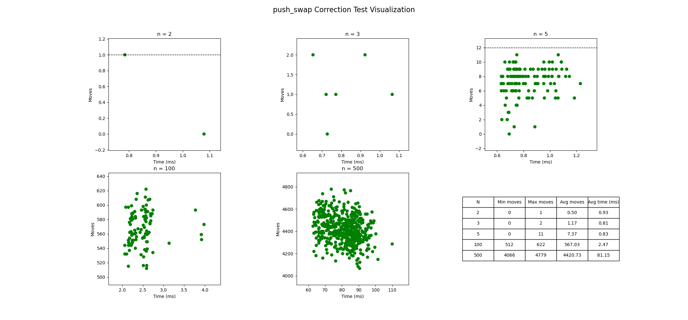

# push_swap Performance Tester

This repository provides two testing tools to evaluate both the **efficiency** and **correctness** of your *push_swap* solution. It offers a visual and interactive way to analyze the number of moves, execution time, and the accuracy of results.


## Usage

1. **Setup**  
   Make sure to have the `push_swap` and `checker` executables in the paths specified within the scripts.

2. **Run the Performance Test**  
   From the repository root, run:
   ```bash
   ./performance.py
   ```
   This script will iterate over various input sizes, display interactive plots, and ultimately perform a curve-fitting analysis to model the solution's complexity.

   

3. **Run the Correctness Test**  
   To check the correctness of your solution, run:
   ```bash
   ./correction.py
   ```
   This script will display:
   - Dynamic plots for `n = 2, 3, 5, 100, 500`  
   - A real-time updating statistics table with minimum, maximum, average moves, and average time  
   - Threshold reference lines to gauge performance at a glance

   

## Repository Contents

- **performance.py**  
  This script runs performance tests over a range of input sizes (from 1 up to `N_MAX`, configurable).  
  - **Features**  
    - Executes multiple tests for each input size  
    - Measures the number of moves and the execution time  
    - Generates dynamic 3D plots (n vs. moves vs. time) and 2D plots (moves vs. n and time vs. n)  
    - Performs a non-linear curve fit using `f(n) = A*n^a + B*log(n)` to estimate the complexity of your solution  

- **correction.py**  
  This script focuses on testing the **correctness** of your solution for specific cases.  
  - **Features**  
    - For `n = 2, 3, 5`, it tests **all** permutations  
    - For `n = 100` and `n = 500`, it runs a fixed number of tests  
    - Provides real-time visualization:  
      - Plots with points colored by result (e.g., green for OK, red for KO, etc.)  
      - A statistics table showing minimum, maximum, and average moves plus the average time (in ms) for each `n`  
    - Displays reference lines (thresholds) to help interpret performance

- **/images**  
  Contains representative screenshots of the tests:
  - `performance.png` – Example of the performance test visualization  
  - `correction.png` – Example of the correctness test visualization

## Requirements

- **Python 3.x**  
- **Python libraries**  
  - `subprocess`  
  - `random`  
  - `time`  
  - `numpy`  
  - `matplotlib`  
  - `tqdm`  
  - `scipy`

- **Required Executables**  
  - `push_swap` (already compiled)  
  - `checker` or `checker_linux` (depending on your setup)

## Contributing and Contact

This project is intended as a learning tool for the 42 community.  
Repository on GitHub: [github.com/cesardelarosa/push_swap_performance_tester](https://github.com/cesardelarosa/push_swap_performance_tester)

If you spot any issues or have suggestions, please open an issue or submit a pull request!

## License

This project is distributed under the **GNU GPLv3** license. Check the [LICENSE](LICENSE) file for details.
